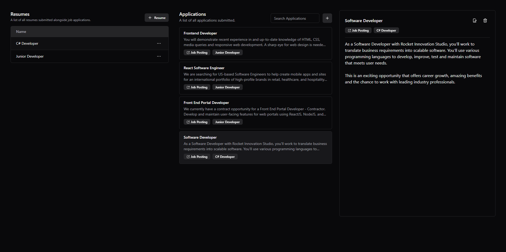
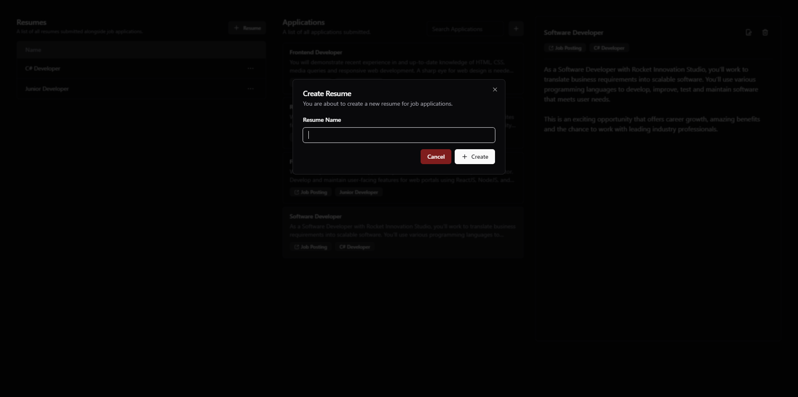
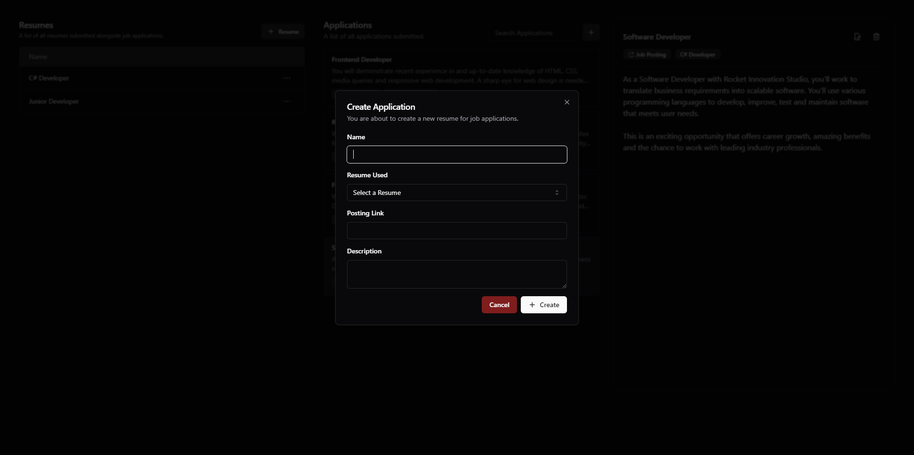
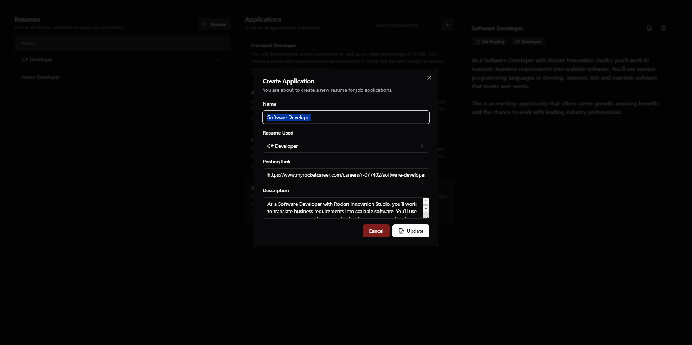

# Job Manager Dashboard

The Job Manager Dashboard is a tool designed to streamline the job search process by tracking applications and the specific resume version used for each position. This project simplifies organizing job applications and tailoring resume variations for different roles.

## Technical Overview

The project follows the OpenAPI standard and features a React.js frontend with a MySQL database for data storage and management. The backend is built with .NET 8 Core Web API, leveraging C# and Entity Framework for data modeling and management. Data is served to the frontend through a robust RESTful API.

## Project Images

Here are some screenshots showcasing the application's frontend design.

